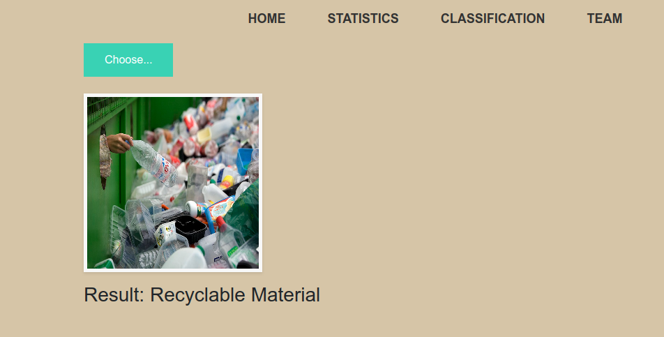
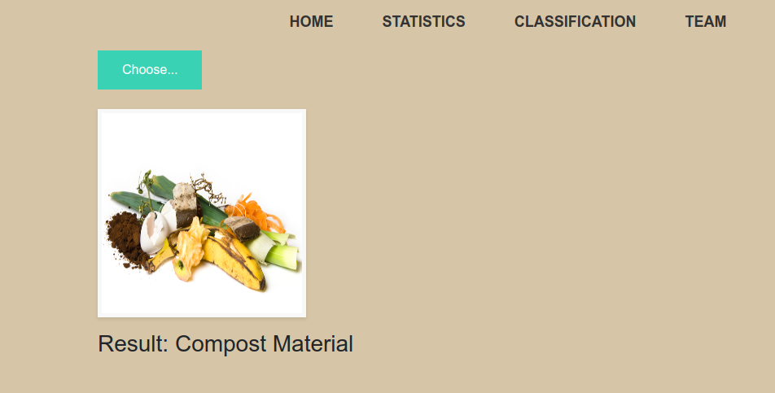
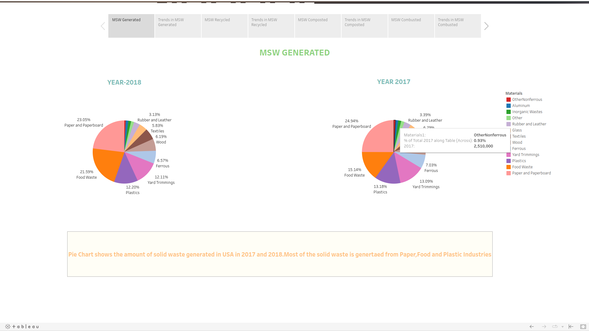
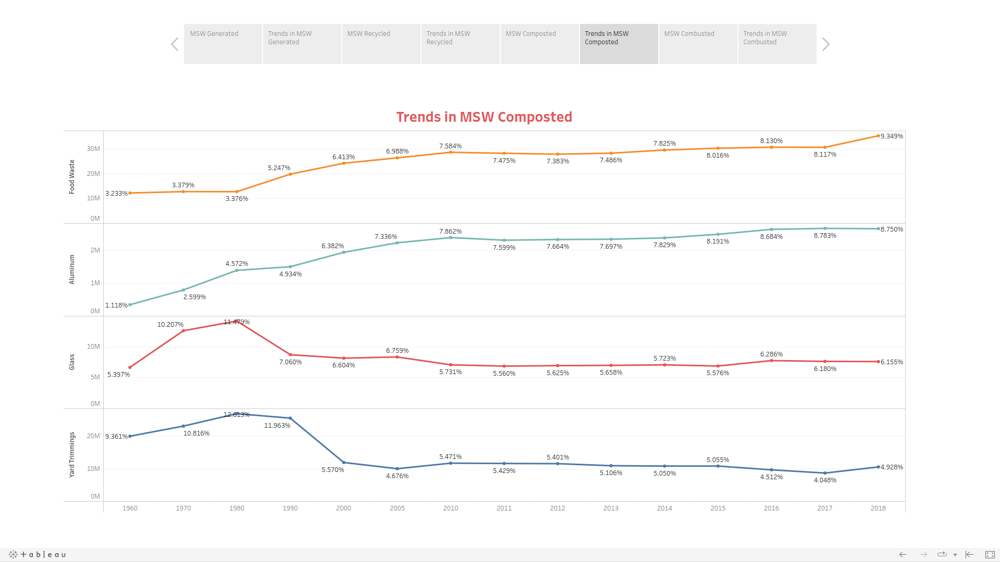
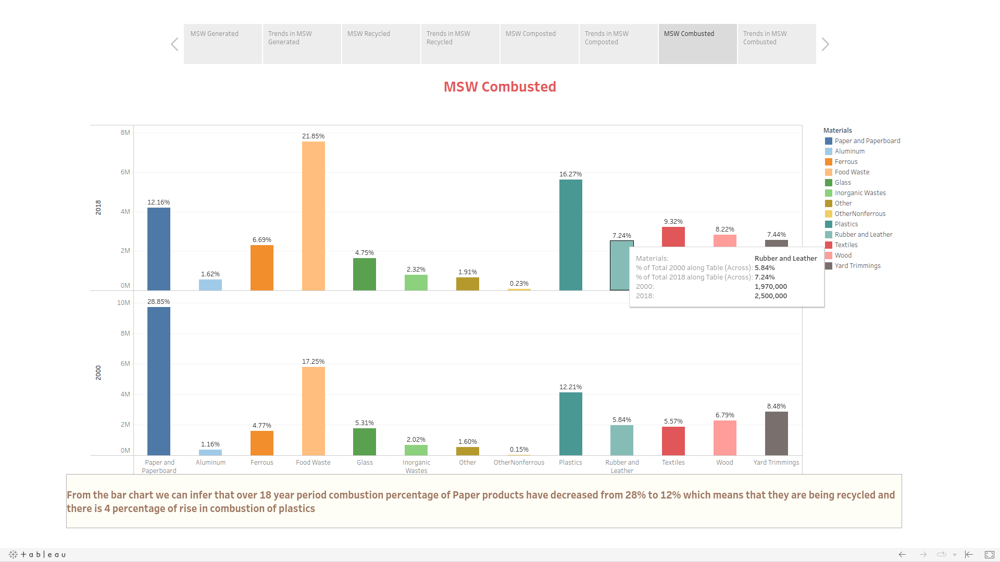
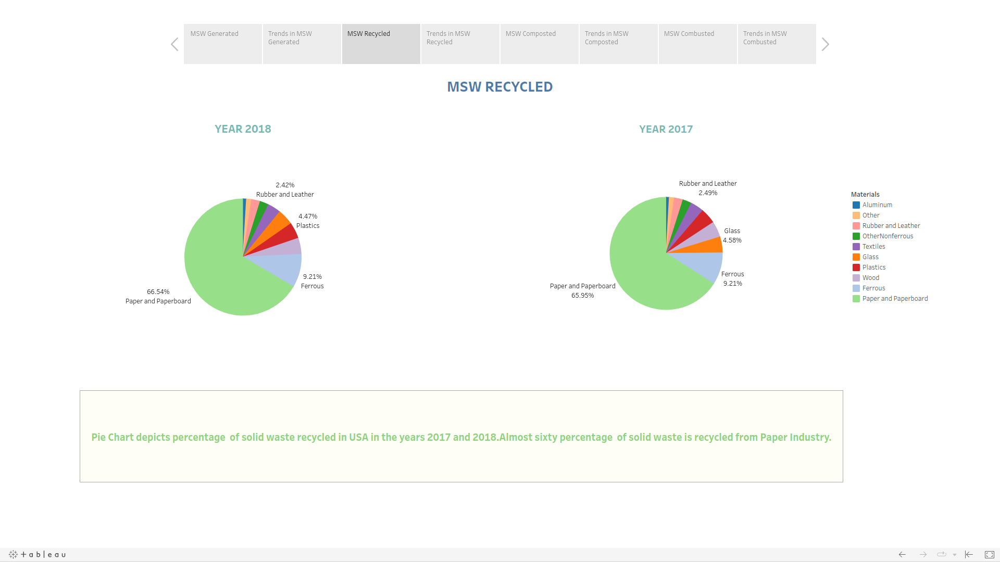

# EcoClassifier Flask App README

The Waste Classifier Flask App is a web application that utilizes a deep learning model to classify images of waste materials as either "Compost Material" or "Recyclable Material." This app is built using the Flask framework and Python programming language. It provides a user-friendly interface where users can upload images and receive real-time predictions about the type of waste material depicted in the image.

## Features

- Image Upload: Users can upload images of waste materials through the web interface.
- Real-time Classification: The uploaded image is processed by a pre-trained deep learning model to predict whether the waste material is compostable or recyclable.
- User-friendly Interface: The app features a simple and intuitive user interface designed for ease of use.

## Prerequisites

Before running the Waste Classifier Flask App, ensure you have the following dependencies installed:

- Python 3.x
- Flask
- torch (PyTorch)
- torchvision
- Pillow (PIL)

You can install these dependencies using the following command:

```bash
pip install Flask torch torchvision Pillow
```

## Usage

1. Clone the repository:

```bash
git clone https://github.com/Code-Crusaders-HooHacks2023/EcoClassifier
cd EcoClassifier
```

2. Make sure you have the pre-trained model weights file (`Hoo_Hacks_model.pth`) located in the `model` directory.

3. Run the Flask app:

```bash
python app.py
```

4. Open your web browser and navigate to `http://127.0.0.1:5000/` to access the Waste Classifier Flask App.

## Output Images

After uploading an image for classification, the app will provide the prediction result, indicating whether the waste material is "Compost Material" or "Recyclable Material." Additionally, the uploaded image along with the prediction will be displayed on the results page.

- Recyclable Material
	

- Compostable Material
	


## Statistics

The `/statistics` endpoint displays a Tableau published page that presents statistics about Municipal Solid Waste generation, recycling, and composting between the years 1960 and 2018. This data provides insights into the waste management practices and trends over the decades.

- Solid Waste Generated
	

- Trends in Solid Waste Composted
	

- Solid Waste Combusted
	

- Solid Waste Recycled
	


## App Structure

- `app.py`: The main application script that defines the Flask routes and sets up the web interface.
- `model/`: Directory containing the pre-trained model weights file (`Hoo_Hacks_model.pth`).
- `static/`: Directory containing static files such as images and stylesheets.
- `templates/`: Directory containing HTML templates for rendering the web pages.

## Routes

- `/`: The home page of the application, providing an overview and introduction.
- `/team`: Information about the development team or relevant stakeholders.
- `/statistics`: Display statistics related to Municipal Solid Waste generation, recycling, and composting.
- `/viz`: Show visualizations or additional information using Tableau or other tools.
- `/model`: Information about the waste classification model and its specifications.
- `/predict` (POST method): The route to which images are uploaded for classification. Returns the prediction result as a response.

## Contributing

Contributions to the Waste Classifier Flask App are welcome. If you encounter any bugs, have suggestions for improvements, or want to add new features, please open an issue or submit a pull request to the repository.

## License

This project is licensed under the [GPL-v3](LICENSE).

